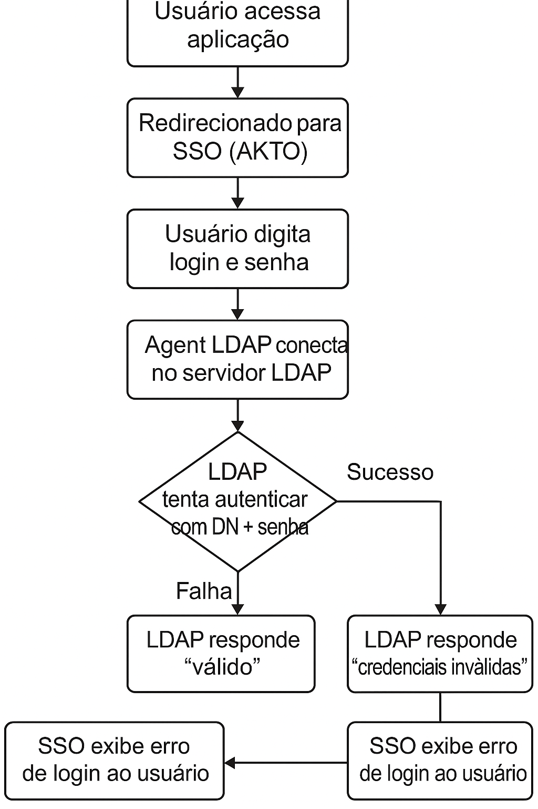

### 🧠 Objetivo da POC

Utilizando aplicação ASP.NET, vamos realzizar uma autenticação B2C.

Testar a integração entre:
* OpenLDAP (container com base de usuários)
* Okta SSO (para autenticação centralizada) / OpenId Connect
* LDAP Agent da Okta (para sincronizar os usuários com o Okta)

### 🧰 Ferramentas
* Docker ou Docker Compose
* Imagem do OpenLDAP (v1.5.0)
* Conta na Okta Developer (https://developer.okta.com/)
* Okta LDAP Agent (precisamos baixar e instalar)
* [Opcional] Admin UI para o OpenLDAP, tipo o phpLDAPadmin

### fluxograma da nossa P.O.C

